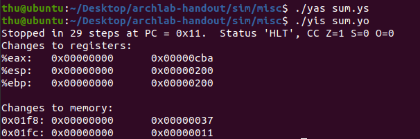
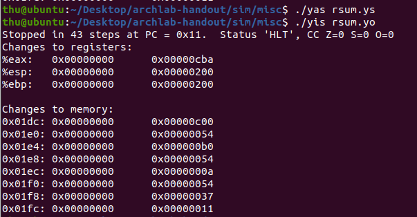
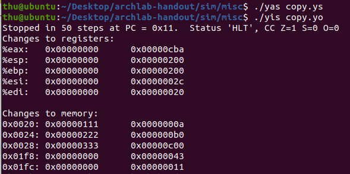
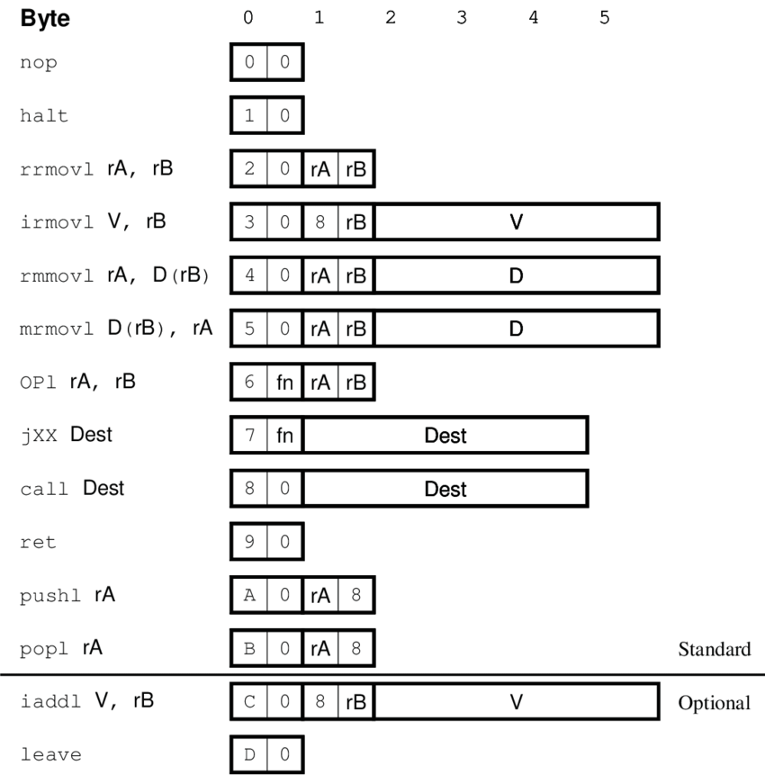
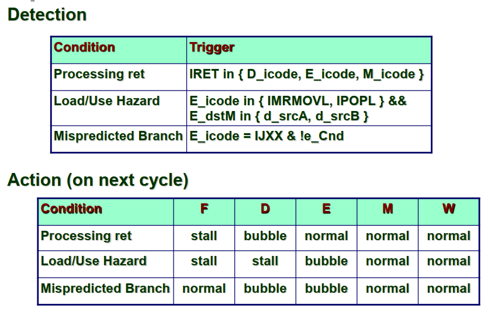

# Architecture Lab

电02 肖锦松 2020010563

## Part A

参照Sample object code file，y86-code/asum.yo。将`examples.c`中的`int sum_list(list_ptr ls)`，`int rsum_list(list_ptr ls)`，`int copy_block(int *src, int *dest, int len)`改写成Y86程序。

根据结构体`ELE`的声明，一个`ELE`实例在内存中的分布是4字节的`val`以及4字节的`ELE*`。

### sum.ys

> Iteratively sum linked list elements
> 实现链表元素顺序累加

```sh
# Xiao Jinsong 2020010563
# Execution begins at address 0
	.pos 0

init:
    irmovl Stack, %esp  # Set up Stack pointer
	irmovl Stack, %ebp  # Set up base pointer
	call Main           # Execute main program
    halt                # Terminate program 

# Sample linked list
    .align 4
ele1:
    .long 0x00a
    .long ele2
ele2:
    .long 0x0b0
    .long ele3
ele3:
    .long 0xc00
    .long 0
# END

Main:	
    irmovl ele1,%edi    # ele1 is in %edi
    call sum_list       
	ret

/* $begin sum-ys 0 */
    # int sum_list(list_ptr ls)
sum_list:
    pushl %ebx
    xorl %eax,%eax      # %eax = sum = 0
    jmp end
loop:
    mrmovl (%edi),%ebx      # %ebx = ls->val
    addl %ebx,%eax          # sum +=  ls->val
    mrmovl 4(%edi),%edi     # %edi = ls->next
end:
    andl %edi,%edi
    jne loop        # while (ls)
    popl %ebx
    ret

/* $end sum-ys 0 */

# The stack starts here and grows to lower addresses
	.pos 0x200		
Stack:	 

```

在`sim/misc`中运行`./yas sum.ys`得到`sum.yo`，再运行`./yis sum.yo`得到运行结果。可以看到`%eax`中存着计算结果`0xcba`，结果正确。



### rsum.ys

> Recursively sum linked list elements
> 实现链表元素递归累加

```sh
# Xiao Jinsong 2020010563
# Execution begins at address 0
	.pos 0

init:
    irmovl Stack, %esp  # Set up Stack pointer
	irmovl Stack, %ebp  # Set up base pointer
	call main           # Execute main program
    halt                # Terminate program 

# Sample linked list
    .align 4
ele1:
    .long 0x00a
    .long ele2
ele2:
    .long 0x0b0
    .long ele3
ele3:
    .long 0xc00
    .long 0
# END

main:	
    irmovl ele1,%edi    # ele1 is in %edi
    call rsum_list       
	ret

/* $begin rsum-ys 0 */
    # int rsum_list(list_ptr ls)
rsum_list:
    pushl %ebx
    xorl %eax,%eax          # %eax = sum = 0
    andl %edi,%edi
    je end                  # if (!ls) return 0
    mrmovl (%edi),%ebx      # %ebx  = ls->val
    mrmovl 4(%edi),%edi     # %edi = ls->next
    call rsum_list
    addl %ebx, %eax         # val + rest;

end:
    popl %ebx
    ret

/* $end rsum-ys 0 */

# The stack starts here and grows to lower addresses
	.pos 0x200		
Stack:	 

```

在`sim/misc`中运行`./yas rsum.ys`得到`rsum.yo`，再运行`./yis rsum.yo`得到运行结果。可以看到`%eax`中存着计算结果`0xcba`，结果正确。




### copy.ys

> Copy a source block to a destination block
> 将长度为len的单元从src复制到dest，并且将所有元素进行xor运算作为返回值

```sh
# Xiao Jinsong 2020010563
# Execution begins at address 0
	.pos 0

init:
    irmovl Stack, %esp  # Set up Stack pointer
	irmovl Stack, %ebp  # Set up base pointer
	call main           # Execute main program
    halt                # Terminate program 

# Sample
    .align 4
# Source block
src:
    .long 0x00a
    .long 0x0b0
    .long 0xc00
# Destination block
dest:
    .long 0x111
    .long 0x222
    .long 0x333
# END

main:	
    irmovl src,%edi     # src is in %edi
    irmovl dest,%esi    # dest is in %edi
    irmovl $3,%edx      # len is in %edx
    call copy_block       
	ret

/* $begin copy-ys 0 */
    # int copy_block(int ⋆src, int ⋆dest, int len)
copy_block:
    pushl %ebx
    pushl %ecx
    xorl %eax,%eax  # %eax = result = 0

loop:
    andl %edx,%edx      # while (len > 0)      
    jle end
    mrmovl (%edi),%ebx
    rmmovl %ebx,(%esi)
    xorl %ebx, %eax     # result ^= val;

    irmovl $4,%ecx
    addl %ecx,%edi      # src++
    addl %ecx,%esi      # dest++
    irmovl $1,%ecx
    subl %ecx,%edx      # len--
    jmp loop            # while (len > 0)

end:
    popl %ecx
    popl %ebx
    ret

/* $end copy-ys 0 */

# The stack starts here and grows to lower addresses
	.pos 0x200		
Stack:	 

```

需要注意的是Y86程序中，运算操作不能直接对立即数，需要先把立即数存入寄存器中。

在`sim/misc`中运行`./yas copy.ys`得到`copy.yo`，再运行`./yis copy.yo`得到运行结果。可以看到`%eax`中存着计算结果`0xcba`，结果正确。



## Part B

Modify the file `seq-full.hcl` and `pipe-full.hcl`  to extend the SEQ and PIPE processor to support two new instructions: `iaddl` and `leave`. 

如书本图-4.2，列出`iaddl` and `leave`指令的各字节



`iaddl`：计算V值和寄存器rB中的值的相加结果，存入寄存器rB

`leave`：Leave 指令则需要取出esp，ebp的值，读取ebp位置的内存，使得new_ebp=(ebp), new_esp = ebp+4

A description of the computations required for the iaddl instruction. Use the descriptions of irmovl and OPl in Figure 4.18 in the CS:APP2e text as a guide.

A description of the computations required for the leave instruction. Use the description of popl in Figure 4.20 in the CS:APP2e text as a guide.

### SEQ

以下，写出`iaddl` and `leave`在顺序实现中的计算。

| 阶段   | iaddl V, rB                                                  | leave                                                        |
| ------ | ------------------------------------------------------------ | ------------------------------------------------------------ |
| 取指F  | $icode:ifun \leftarrow M_1[PC]$<br />$rA:rB\leftarrow M_1[PC+1]$<br />$valC=M_4[PC+2]$<br />$valP\leftarrow PC+6$ | $icode:ifun \leftarrow M_1[PC]$<br />$rA:rB\leftarrow M_1[PC+1]$<br />$valP\leftarrow PC+1$ |
| 译码D  | $valB \leftarrow R[rB]$                                      | $valA \leftarrow R[\%esp]$<br/>$valB  \leftarrow R[\%ebp]$   |
| 执行E  | $valE \leftarrow valC+valB$<br />$Set CC$                    | $valE \leftarrow 4+valB$                                     |
| 访存M  |                                                              | $valM \leftarrow M_4[valB]$                                  |
| 写回W  | $R[rB] \leftarrow valE$                                      | $R[\%esp] \leftarrow valE$<br />$R[\%ebp] \leftarrow valM$   |
| 更新PC | $PC \leftarrow valP$                                         | $PC \leftarrow valP$                                         |

根据上表，在各个阶段进行修改，参考书本278页以及代码注释对各信号的解释。

因此：

* **Fetch stage**

  将`IIADDL`加入到`instr_valid`，`need_regids`，`need_valC`
  将`ILEAVE`加入到`instr_valid`

* **Decode Stage**

  将`IIADDL`的`srcB`和`dstE`设为`rB`
  将`ILEAVE`的`srcA`和`dstE`设为`RESP`，`srcB`和`dstM`设为`REBP`

* **Execute Stage**

  将`IIADDL`的`aluA`设为valC，`aluB`设为valB，由于仍采用加法，`alufun`不变，加入`set_cc`中
  将`ILEAVE`的`aluA`设为4，`aluB`设为valB

* **Memory Stage**

  `IIADDL`无行为
  将`ILEAVE`加入`mem_read`，`mem_addr`设为valB

* **Program Counter Update**
  `IIADDL`和`ILEAVE`的PC更新均为默认情况valP，无需更改

### PIPE

引入流水线后，存在数据冒险和控制冒险。指令阶段依次为$F\rightarrow D\rightarrow E \rightarrow M \rightarrow W$

`IADDL`，存在数据冒险，因为其修改了R[rB]。但在M、E、D阶段设置后，代码完成了数据转发，这和课件上的`addq`十分类似。
`ILEAVE`，除了数据转发可以解决的数据冒险，由于在M阶段有内存读取，因此可能产生加载/使用冒险，必须利用暂停加转发来解决。另外，还得处理ret，预测错误的分支等等。参照课件的解决方案，以及代码注释的提示，对各个阶段插入暂停、气泡。



因此：

* **Fetch stage**

  同SEQ

* **Decode Stage**

  `IIADDL`同SEQ，只是此时为`D_rB`
  **稍作修改**，将`ILEAVE`的`d_srcB`和`d_dstE`设为`RESP`，`d_srcA`和`d_dstM`设为`REBP`，这样才能让ebp的值留到访存阶段  

* **Execute Stage**

  同SEQ，只是此时为`E_valC`，`E_valB`

* **Memory Stage**

  同SEQ，此时根据上面修改，`ILEAVE`的`mem_addr`设为M_valA

* **Program Counter Update**
  `IIADDL`同SEQ
  `ILEAVE`需要加入Conditions for a load/use hazard：`F_stall`，`D_stall`，`D_bubble`，`E_bubble`。

## Part C

鉴于期末阶段压力巨大，选择略过该选做部分，希望寒假有时间可以好好探究。

## Summary

这次的Archlab由易到难，Part A让我熟悉了一些Y86的指令，由于我对汇编语言还不是特别熟悉，所以在Part A部分也花了不少时间去琢磨，主要是参考示例代码。对我来说比较难的部分在Part B，SEQ部分相对来说还比较好理解，因此做起来也比较快，只需要知道各个阶段需要做什么事情，传什么数据就可以。PIPE部分我花的时间比较久，但这主要源于我对于课上的Pipeline内容本身就没有太理解，为此，我反复看了几遍CSAPP这一节的内容，终于是小有收获。我曾经在本专业的数字电路课程中学习过Pipeline，但主要都是在做计算，如吞吐率、最佳划分等等。这次Lab让我对处理器的流水线流程更加熟悉，也为期末复习啃下了一块硬骨头！

